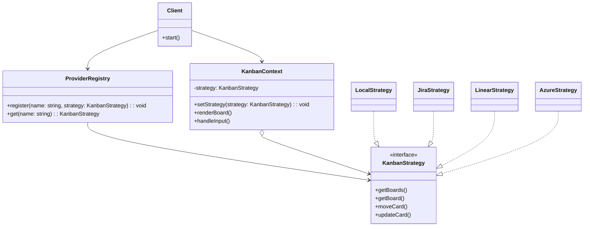

# boardctl

*Lazygit for work tracking - one board, any backend.*

**boardctl** is a terminal-first kanban board designed to be your universal command center for all things kanban. Whether you’re working in Jira, Zenhub, or even a local kanban configuration, boardctl gives you a consistent, keyboard-driven workflow - no mouse, no context switching.


## Features

- **Unified workflow:** One interface, many backends (Jira, Zenhub, Linear, Azure, local files, and more).
- **Terminal native:** Built for speed and focus. Never leave your terminal.
- **Extensible:** Add new providers with a simple strategy interface.

## Getting Started

Clone the repo, install dependencies, and run:

```sh
pnpm install
pnpm run start      # Launch boardctl
pnpm run dev        # Watch mode for development
pnpm run debug      # Debug mode with console outp

```bash
$ npm install --global boardctl
```

## Under the Hood


